# Inconsistencies — visual review

**Captured:** 2026-09-17 · 1440×900 (desktop) and 390×844 (phone) · running app at `http://localhost:3000` · fixture data.

This is a **picture map**, not a new audit. The written inventory is [ds-product-audit.md](ds-product-audit.md). Use this file to *see* the same jobs solved differently.

**How to read each pair:** look at the two (or more) screens, then the one-line “what drifted.” Skip anything that looks like a real product difference (advocate home vs court cause list *should* differ). Flag only where the *furniture* should have been the same.

Atoms (buttons, inputs, badges, charcoal rail) are largely consistent. The drift is in **chrome**, **queues**, and **which action is teal**.

---

## 0. What is *not* broken

These look like one system. Do not “fix” them into something new.

- Both sides use the same charcoal rail, brand glyph, and person chip at the foot.
- Court tables share one header well (sunken, caption, hairline rows). That recipe is copied, but it *looks* like one table.
- Status chips (Scheduled / Evidence / Pending signature) use the same Badge family.
- Empty states (court home, vakalatnama) already use `Empty` inside a raised panel.

The problem is not “the product looks unlike the DS.” The problem is **the same product object was rebuilt per screen**.

---

## 1. Two products, two frames

Advocate chrome carries language + notifications. Court chrome carries a breadcrumb trail and puts the page’s primary in the header (or not). Same rail colour; different top bar contract.

**Advocate home** — language switch, bell, companion rail, greeting. No breadcrumb.

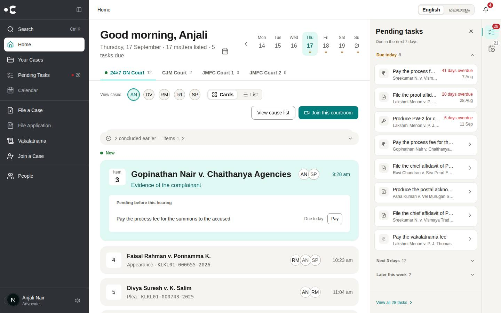

**Court — today’s hearings** — `Court home > Hearings`, no language, no bell. Join VC is the one teal in the header.

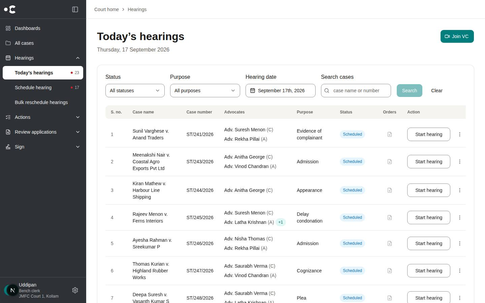

**What drifted:** top bar contents, breadcrumb vs page title, where the primary action lives. Users who cross from advocate to bench re-learn the frame.

**Do:** one top-bar slot model (leading / trail / trailing). Language and bell are advocate-only *content*, not a second bar component.

---

## 2. The court queue is one screen, copied

Register, schedule, delay condonation, and Others are the same object: title + count · raised panel · filters · table · Search teal.

**Register cases** — Search is the only teal.

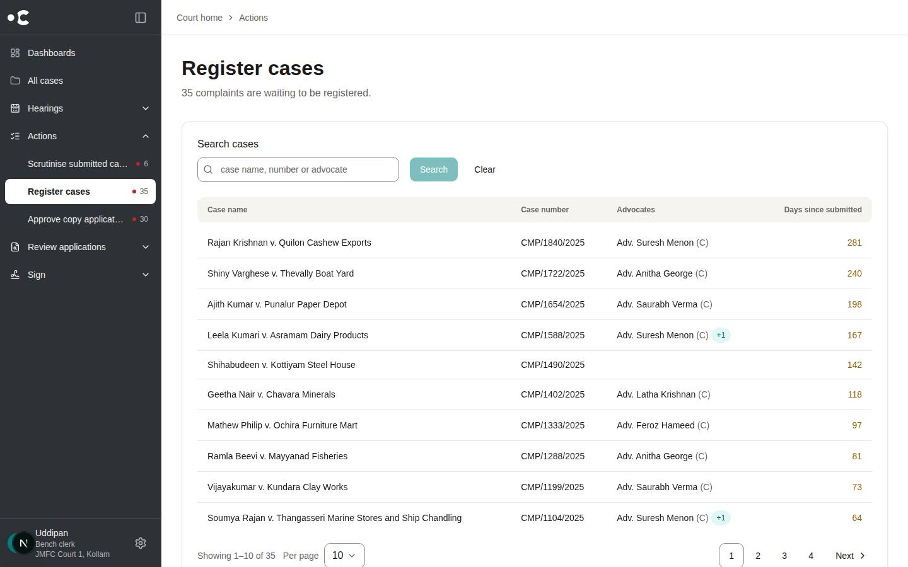

**Schedule hearing** — same skeleton, Stage + Search.

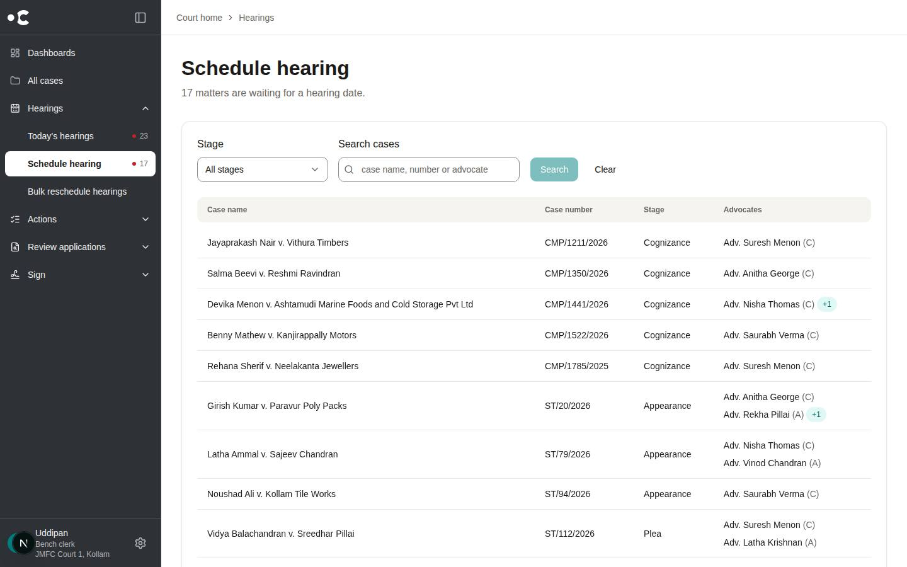

**Delay condonation** — same again.

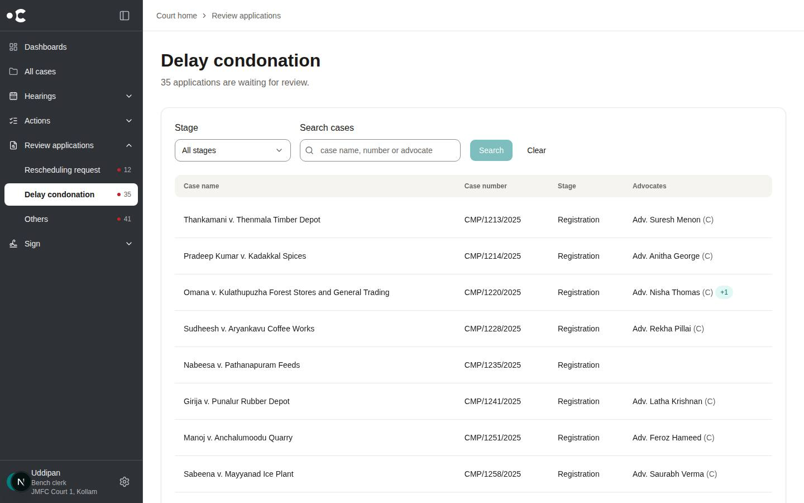

**Others** — same, plus an extra Application type select.

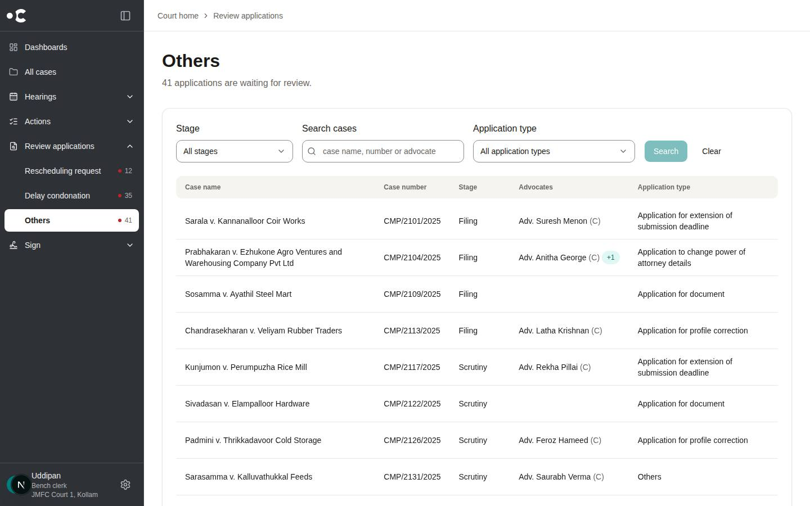

**What drifted:** nothing visible — which is the tell. Sixteen files produce one look. The next queue will copy-paste again and eventually one of them will slip.

**Do:** one `QueuePanel` + `FilterBar` + `DataTable` in product chrome. Stop new `headClass` copies.

---

## 3. Which button is allowed to be teal?

The Law is “one primary per view.” The product disagrees on *which* control earns it.

| Screen | Teal control | Search |
|---|---|---|
| Today’s hearings | **Join VC** (header) | Quiet (green-grey) |
| Register / schedule / delay / others | **Search** | Teal |
| Sign orders / sign process | **Search** in the panel, *and* a teal in the sticky footer | Two teals once a row is selected |
| Advocate home | **Join this courtroom** | n/a |
| Case file | **Make filings** | n/a |
| Filing upload | **Continue to filing** | n/a |

Hearings (Search yielded to Join VC):

Register (Search *is* teal):

Sign orders at rest — Search teal **and** a footer primary (disabled-looking until selection):

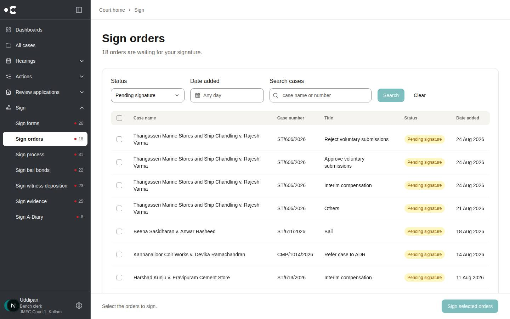

Sign orders with rows selected — footer goes full teal. Search stays teal too.

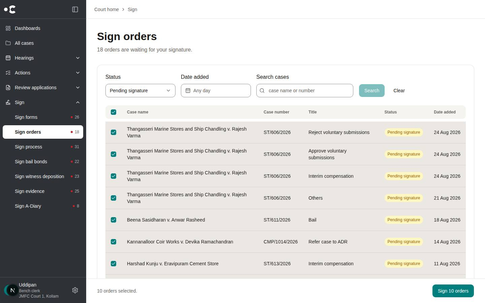

Bulk reschedule — Search teal, in-panel Apply teal, footer Reschedule teal.

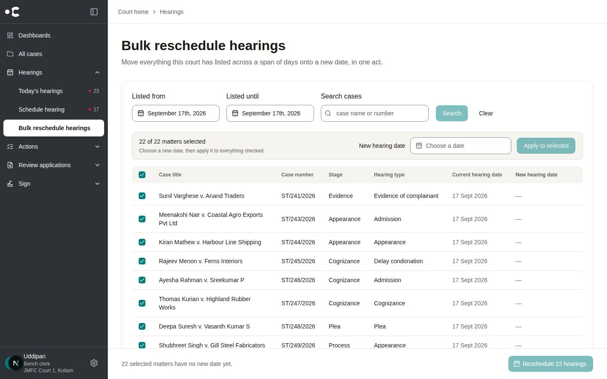

**What drifted:** the rationed primary. Hearings did the honest version (one teal, Search secondary). Most queues did not.

**Do:** product rule — Search is never the page primary. Sticky bulk actions *are* the primary when they appear; Search stays secondary.

---

## 4. Filters: apply-on-submit vs live vs something else

**Court queues** — type, then press Search (draft vs applied).

**Scrutiny** — no Search button. Typing filters immediately. Line tabs above the panel.

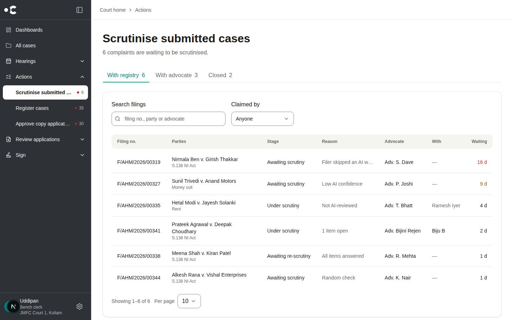

**Advocate cases** — live search, no Search button. View tabs (Ongoing / Long pending / …) sit beside the field, not as line tabs.

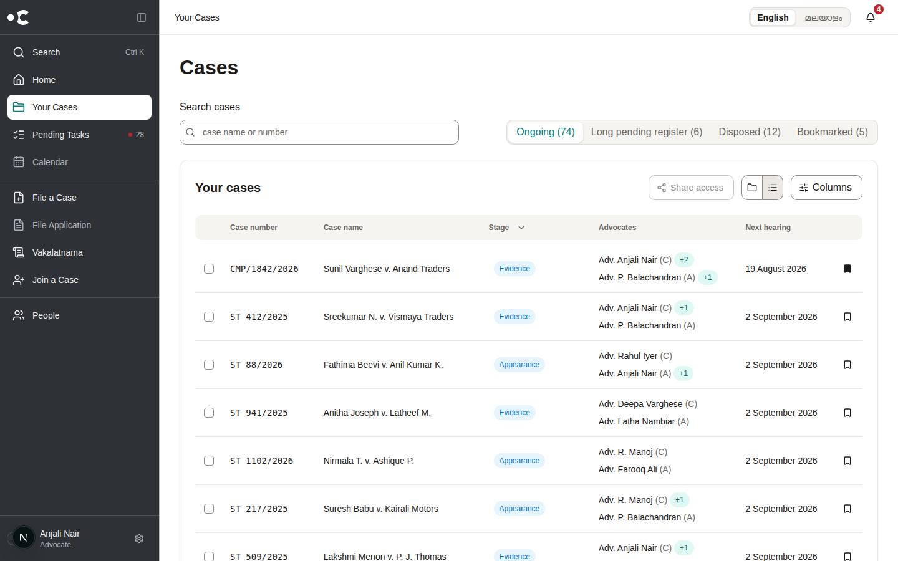

**Tasks** — live search + a Filters button. Kind cards above the table, not a filter row of selects.

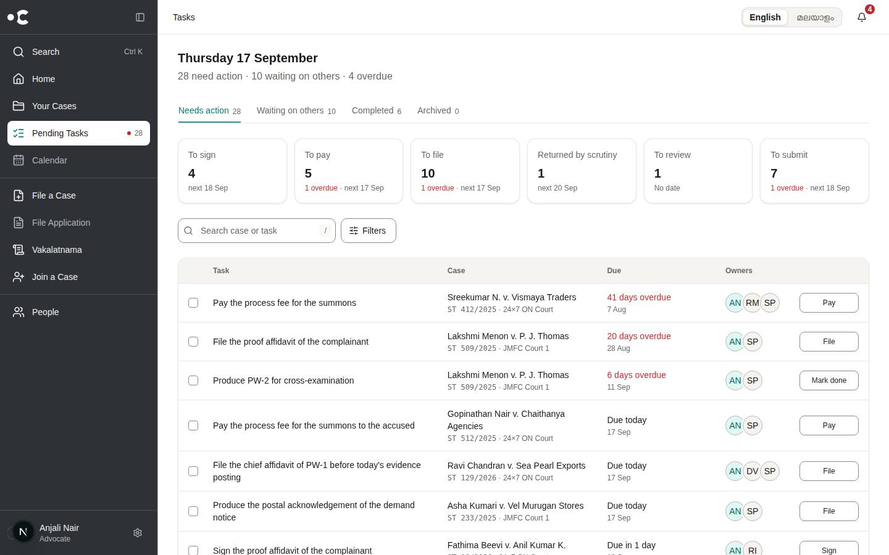

**Filings** — live search + sort. Line tabs *inside* the card (Drafts / Pending scrutiny / …). Empty state in the same panel.

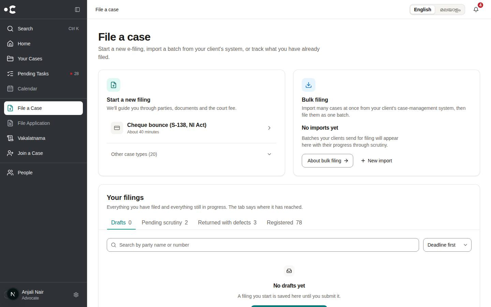

**People** — live search + sort. Not the court table at all (avatar rows, no header well).

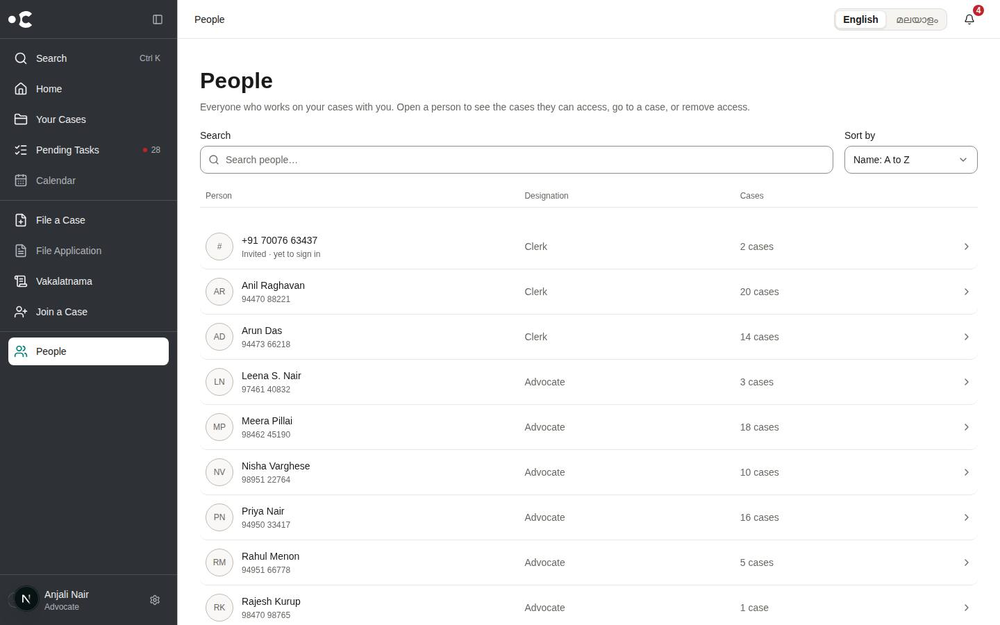

**What drifted:** four filter grammars for “narrow a list.” Scrutiny’s live filter is a documented exception; cases/tasks/filings never adopted the court Search button.

**Do:** court queues share one FilterBar (apply-on-submit). Advocate collections can stay live — but pick **one** advocate grammar (search field + tabs), and stop inventing a third.

---

## 5. Tables: same well, different density and status

The sunken header + hairline rows are shared. What sits *in* the cells is not.

- Court hearings: status as a **blue chip**, row action **Start hearing** (outline, not teal — correct).
- Sign orders: status as a **yellow chip**.
- Tasks: due as **red/black text**, not a chip. Row action is a verb button (Pay / File / Sign).
- Cases: stage as a **blue chip**, bookmark on the row, no verb column.
- People: not a table.

Tasks due as ink (loud on repeating rows):

The same idea on the case file, as a yellow badge (“Due in 6 days”):

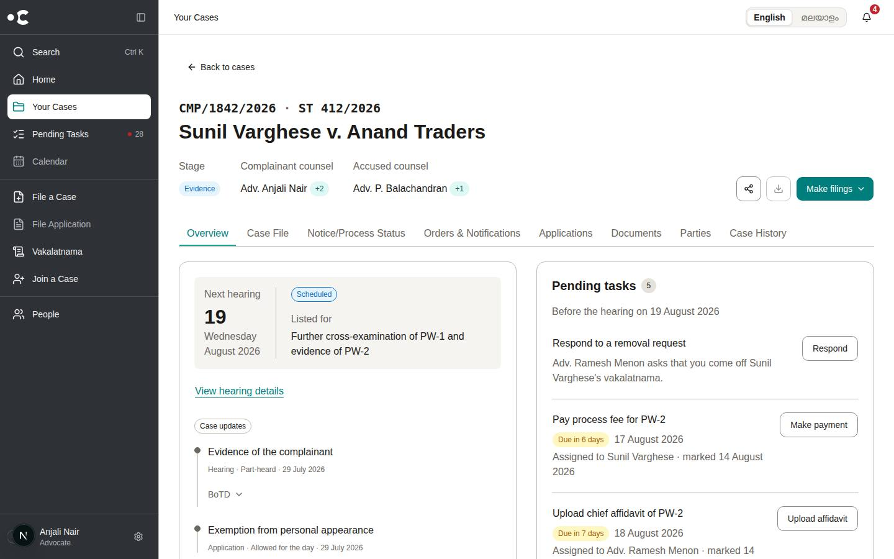

**What drifted:** due/status loudness. The tasks/home choice (ink on repeating rows) vs overview choice (one badge) is **intentional**. Court yellow vs blue chips are just different Badge variants of real states — fine.

**Do:** keep the loudness split. Write it down so the next screen does not add a third (e.g. a red chip on every task row).

---

## 6. Same case, two headers

**Sunil Varghese v. Anand Traders** as the advocate case file:

…and as the court hearing overview:

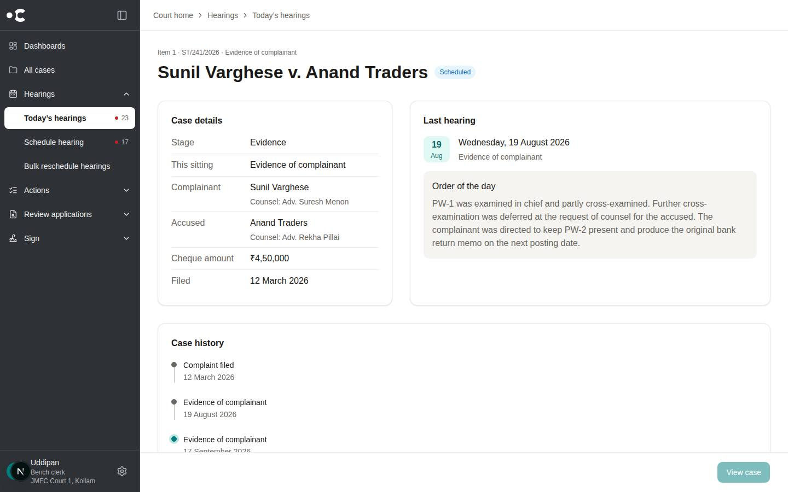

**What drifted:** page header. Advocate: back link, dual case numbers, counsel chips, **Make filings** primary, line tabs. Court: breadcrumb, item caption, Scheduled chip, description-list cards, **View case** in a sticky footer (and it is the unwired primary that still looks live).

These *should* differ in content. They should not differ in “how a title + status + one action are composed.” Court View case is the `aria-disabled` hole from the audit.

**Do:** one page-header recipe (title, status, one primary). Court View case gets the real unavailable look once the DS owns `aria-disabled`.

---

## 7. Sticky action bars

Filing upload — back left, save state, Continue teal. This is the cleanest version.

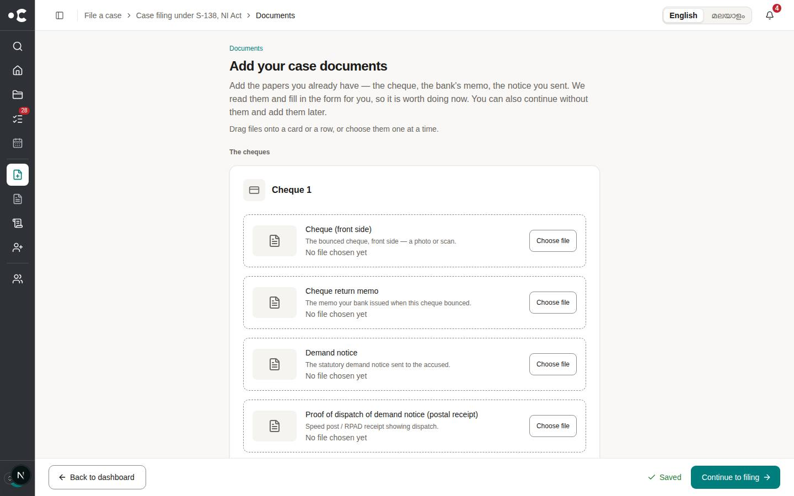

Court sign orders / sign process / bulk reschedule / hearing overview all repeat a bottom band with a slightly different primary.

Hearing overview — View case parked bottom-right, looking fully live:

**What drifted:** z-index and seam are the same idea, implemented per screen. Filing did it once (`FilingFooter`). Court copied the classes.

**Do:** one `StickyActionBar`. Filing and court both use it.

---

## 8. Empty states

Court home is a placeholder empty. Vakalatnama is a *real* empty (CTA in the header). Same `Empty` primitive, two jobs.

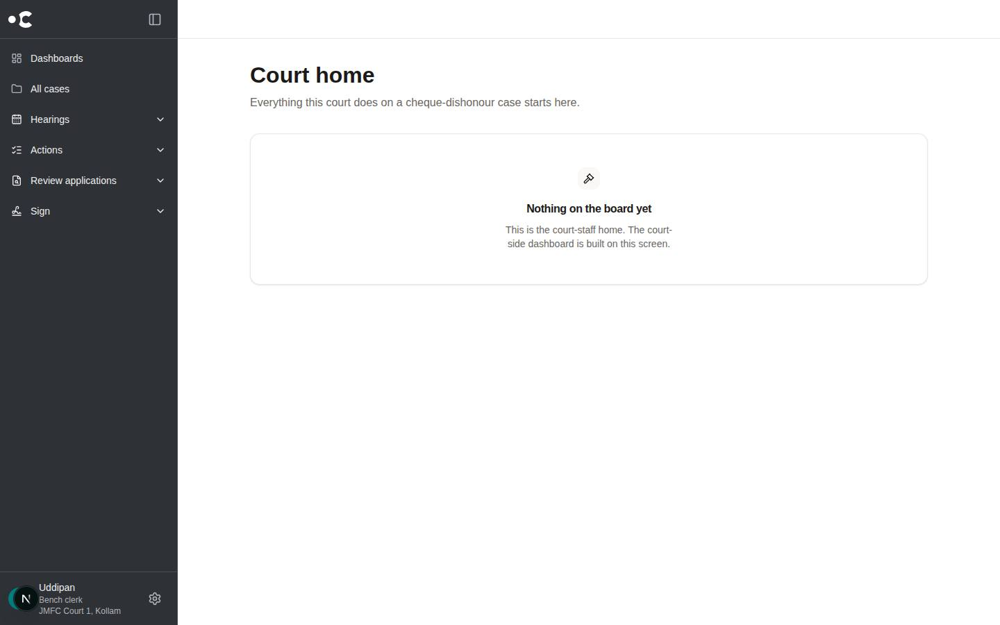

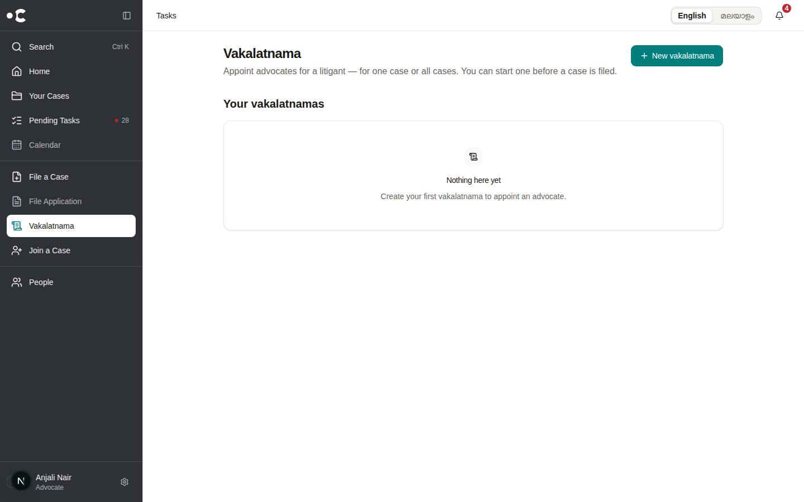

Filings “No drafts yet” lives *inside* the queue card, not as a page empty.

**Do:** page-level empty (nothing exists yet) vs in-panel empty (this tab is empty). Both already exist; don’t invent a third.

---

## 9. Phone: two list answers

Court hearings on a phone become stacked cards (Join VC full-width, filters stacked, Search still not teal).

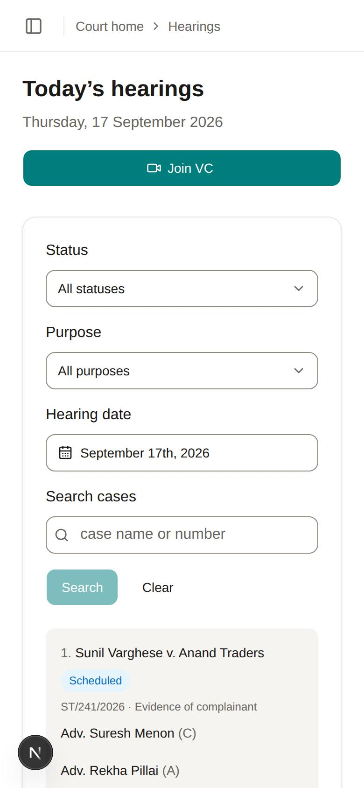

Advocate cases on a phone become labelled field stacks inside a card (share / folders / columns still present — cramped).

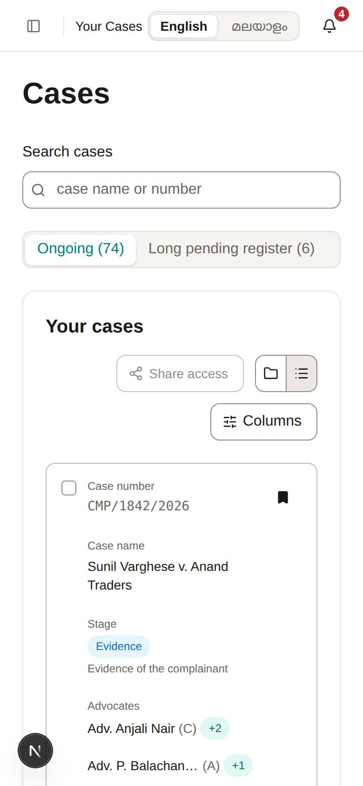

Advocate home on a phone keeps the dense desktop composition (week strip, roster chips, now card).

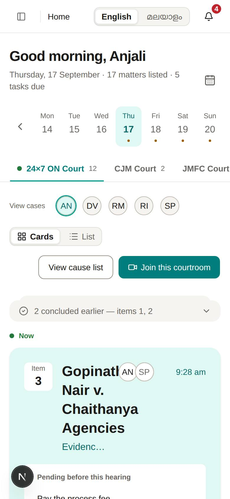

**What drifted:** every court queue has its own `*ItemList`. Cases has another. There is no shared “row on a phone” pattern, so density and which actions survive the squeeze are accidental.

**Do:** one mobile results pattern for queues. Advocate home is allowed to be its own layout.

---

## 10. Selects covering the table

Opening Status on hearings lays the menu over the table header. Filing forms already force `popper` under the field; court filters do not.

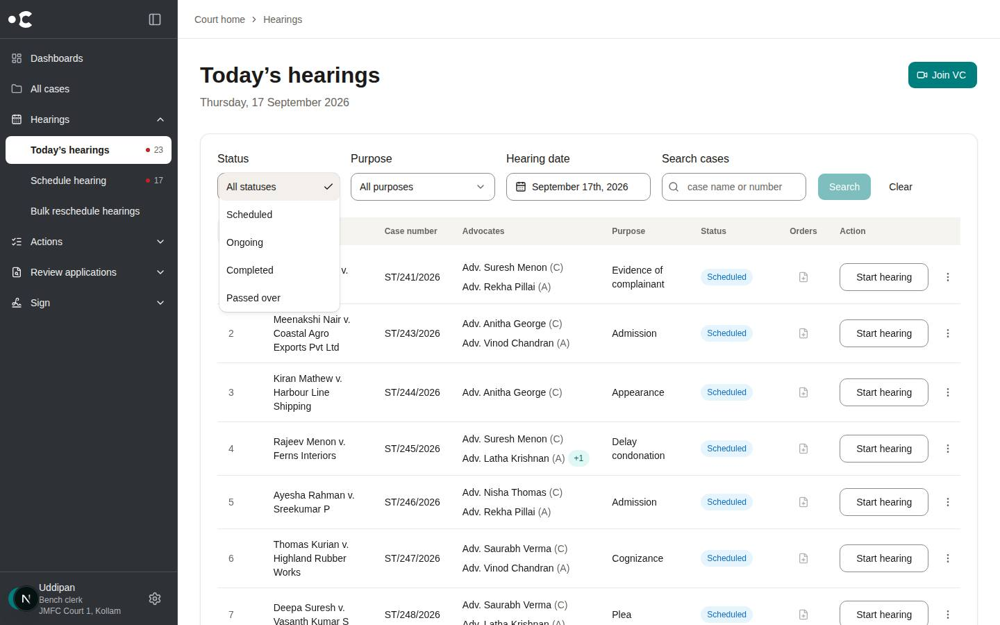

**Do:** DS default `popper` (or the filing recipe on every court Select). This is the small primitive hole, made visible.

---

## 11. Upload rows (the slot the DS cannot finish)

Filing’s first step shows dashed DocumentSlot rows with Choose file on the right — composed *around* the primitive because it has no actions/description slot.

**Do:** extend DocumentSlot upstream. Until then, this filing row is the one upload pattern; don’t add a second (the vakalatnama filename button).

---

## 12. Join a case

One landing + one dialog on this path. The *code* still has a second, larger dialog on the advocate home summons path — not pictured as a second UI because this is the manual join.

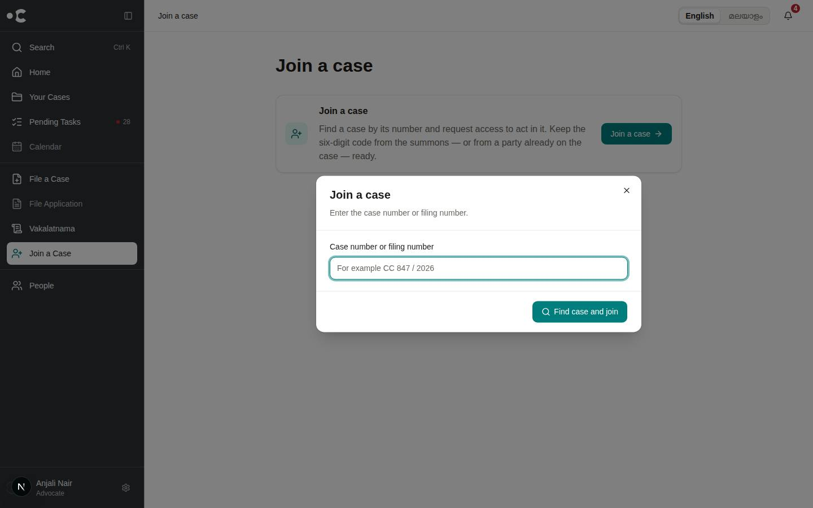

**Do:** one dialog implementation. Visual language here is already DS Dialog + Field + primary. The inconsistency is in the repo, not on this screenshot.

---

## What to do, in the order the pictures suggest

1. **Write the teal rule** (Search is never primary). Hearings already shows it. Align the other queues.
2. **Extract the court queue** you can see six times in §2. One component, many datasets.
3. **One sticky bar** — filing already has the picture (§7).
4. **One top bar contract** — trail in the middle, trailing slot for language/bell *or* page primary, not two bar components (§1).
5. **Select opens under the field** (§10) and **unavailable primary looks unavailable** (§6) — DS patches.
6. Leave advocate home, case peek, and the now-card alone. They are meant to be the one loud surface.

---

## Appendix — all captures

Desktop 1440×900 unless noted.

| File | Route |
|---|---|
| `01-advocate-home.jpg` | `/advocate` |
| `02-court-hearings.jpg` | `/employee/hearings` |
| `03-advocate-cases.jpg` | `/cases` |
| `04-advocate-tasks.jpg` | `/tasks` |
| `05-filings-dashboard.jpg` | `/filings` |
| `06-court-register.jpg` | `/employee/register-cases` |
| `07-court-sign-orders.jpg` | `/employee/sign-orders` |
| `08-court-scrutiny.jpg` | `/employee/scrutiny` |
| `09-court-schedule.jpg` | `/employee/hearings/schedule` |
| `10-court-delay.jpg` | `/employee/delay-condonation` |
| `11-court-home.jpg` | `/employee` |
| `12-case-file.jpg` | `/cases/c-1001` |
| `13-join-landing.jpg` | `/join-case` |
| `14-people.jpg` | `/people` |
| `15-vakalatnama.jpg` | `/vakalatnama` |
| `16-sign-forms.jpg` | `/employee/sign-forms` |
| `17-sign-process.jpg` | `/employee/sign-process` |
| `18-bulk-reschedule.jpg` | `/employee/hearings/bulk-reschedule` |
| `19-hearing-overview.jpg` | `/employee/hearings/h-241` |
| `20-court-other-apps.jpg` | `/employee/other-applications` |
| `21-join-dialog-advocate.jpg` | `/join-case` with dialog open |
| `22-hearings-status-select-open.jpg` | hearings Status menu |
| `23-sign-orders-selected.jpg` | sign orders, rows checked |
| `24-filings-new.jpg` | `/filings/new` (upload step) |
| `30–35` | same screens at 390×844 |

`*b-*-full.jpg` are tall full-page dumps if you need to scroll the rail and the list together.
